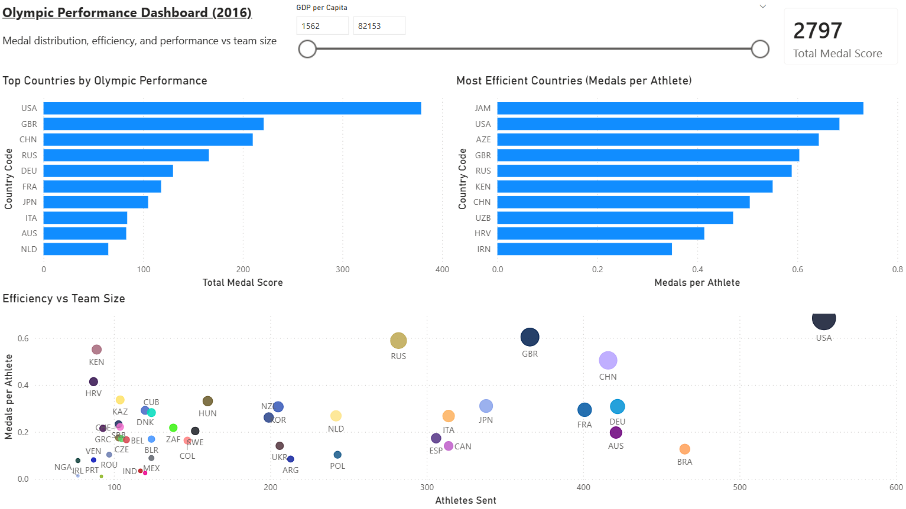
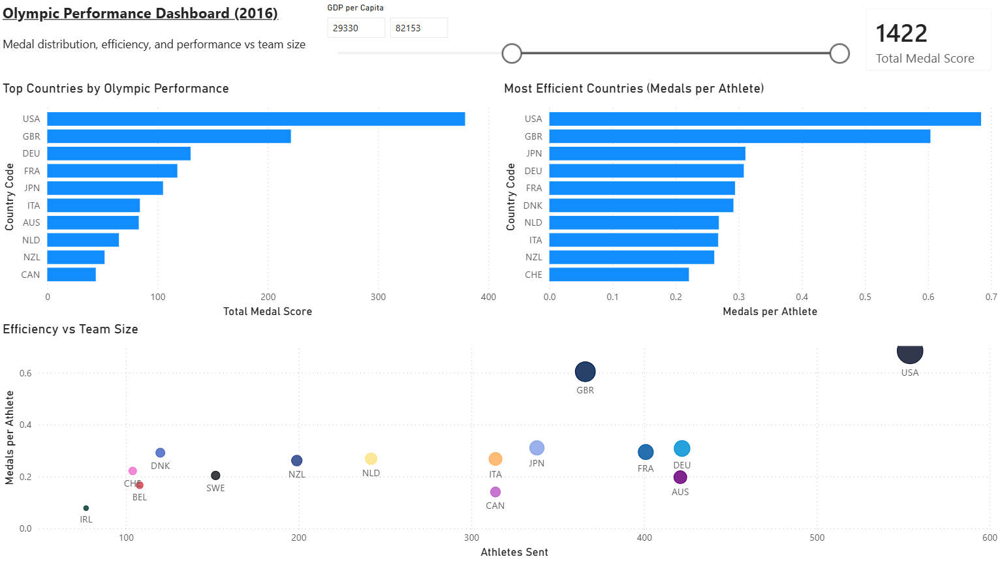

# Olympic Performance Dashboard (Power BI)

This project explores Olympic performance across ~85 countries using Power BI.

## Overview

The dashboard analyses:
- Medal distribution across countries
- Efficiency (medals per athlete)
- Relationship between team size and performance
- Impact of economic factors (GDP per capita)

## Key Features

- Built using Power BI Desktop
- Custom DAX measure: Medals per Athlete
- Top 10 filtering for performance comparison
- Scatter plot analysing efficiency vs team size
- Interactive GDP filtering
- Controlled cross-filtering for consistent insights

## Dashboard Preview

### Overview

### GDP Filter Example

## Data

Data was cleaned and prepared in R prior to visualisation in Power BI.

## Related Project

This dashboard is based on a separate analysis project:

[Olympic Data Analysis](https://github.com/JudeBall03/olympic-data-analysis)
